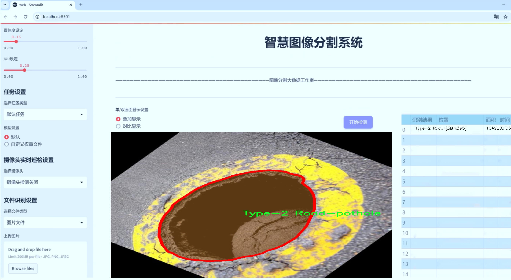
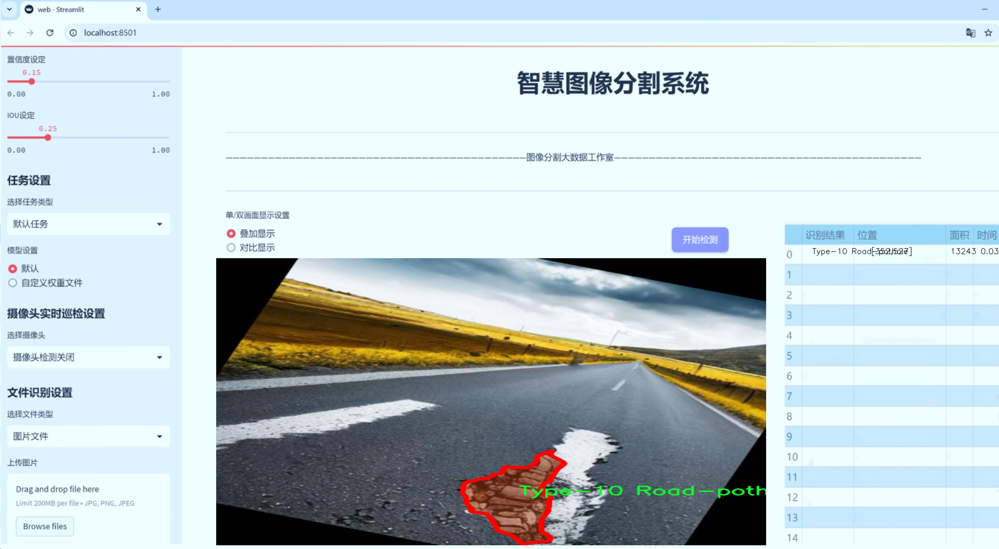
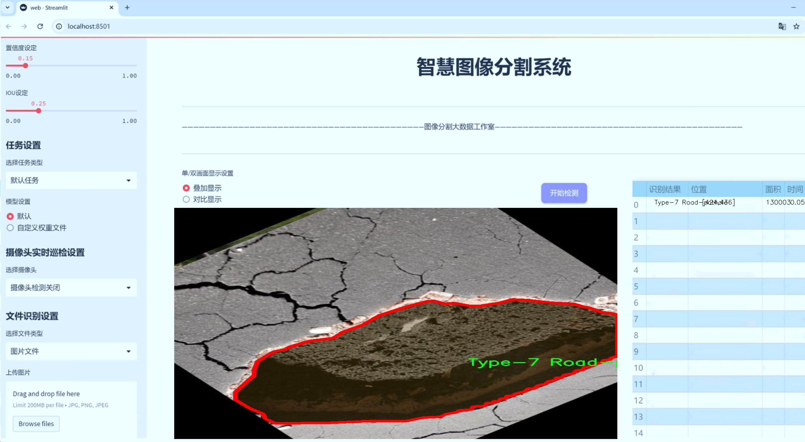
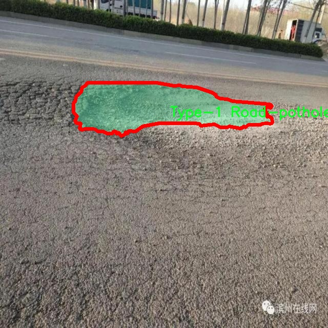
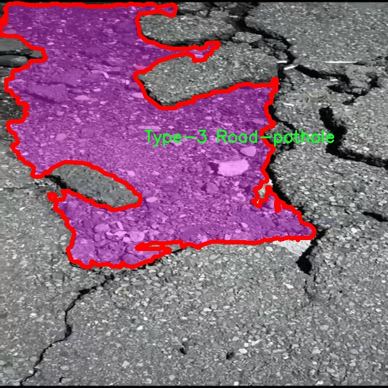
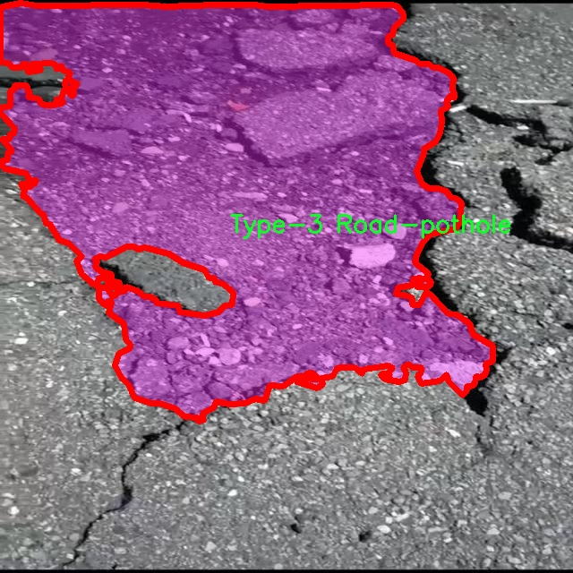
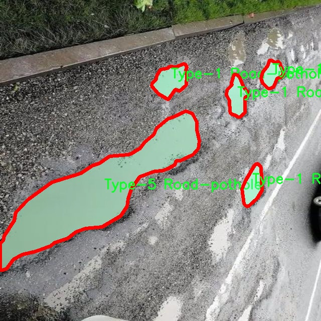
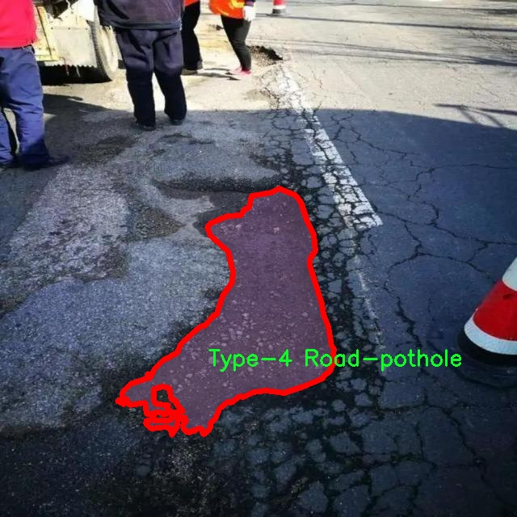

# 道路坑洞分割系统源码＆数据集分享
 [yolov8-seg-C2f-DiverseBranchBlock＆yolov8-seg-RevCol等50+全套改进创新点发刊_一键训练教程_Web前端展示]

### 1.研究背景与意义

项目参考[ILSVRC ImageNet Large Scale Visual Recognition Challenge](https://gitee.com/YOLOv8_YOLOv11_Segmentation_Studio/projects)

项目来源[AAAI Global Al lnnovation Contest](https://kdocs.cn/l/cszuIiCKVNis)

研究背景与意义

随着城市化进程的加快，城市道路的使用频率显著增加，随之而来的道路损坏问题也日益严重。道路坑洞不仅影响了交通安全，还对车辆的正常行驶造成了威胁，甚至可能导致交通事故的发生。因此，及时发现和修复道路坑洞成为了城市管理和维护的重要任务。传统的道路坑洞检测方法多依赖人工巡查，这种方式不仅效率低下，而且容易受到人为因素的影响，难以保证检测的全面性和准确性。为了解决这一问题，近年来，基于计算机视觉和深度学习的自动化检测技术逐渐受到关注，尤其是实例分割技术在目标检测中的应用，为道路坑洞的识别和分割提供了新的思路。

YOLO（You Only Look Once）系列模型因其高效的实时检测能力而广泛应用于各类目标检测任务。YOLOv8作为该系列的最新版本，进一步提升了检测精度和速度，适用于复杂的道路环境。然而，尽管YOLOv8在目标检测方面表现出色，但在道路坑洞的实例分割任务中仍然存在一定的局限性。为了提高YOLOv8在道路坑洞分割中的性能，本文提出了一种改进的YOLOv8模型，旨在通过优化网络结构和训练策略，增强其对不同类型道路坑洞的分割能力。

本研究所使用的数据集包含3300幅图像，涵盖了10种不同类型的道路坑洞。这些数据不仅为模型的训练提供了丰富的样本，还为后续的性能评估提供了可靠的依据。通过对不同类型的道路坑洞进行标注和分类，研究者能够更深入地分析各类坑洞的特征，进而提升模型的分割精度。此外，数据集的多样性使得模型在实际应用中具备更强的适应性，能够应对不同环境和条件下的道路坑洞检测任务。

本研究的意义在于，通过改进YOLOv8模型，实现对道路坑洞的高效分割，不仅可以提高道路维护的效率，还能为城市交通管理提供数据支持，减少因道路损坏引发的交通事故。同时，研究成果有望为其他领域的实例分割任务提供借鉴，推动计算机视觉技术在城市基础设施管理中的应用。通过将深度学习与道路维护相结合，本文为实现智能交通系统的目标迈出了重要一步，具有重要的理论价值和实际应用前景。

### 2.图片演示







##### 注意：由于此博客编辑较早，上面“2.图片演示”和“3.视频演示”展示的系统图片或者视频可能为老版本，新版本在老版本的基础上升级如下：（实际效果以升级的新版本为准）

  （1）适配了YOLOV8的“目标检测”模型和“实例分割”模型，通过加载相应的权重（.pt）文件即可自适应加载模型。

  （2）支持“图片识别”、“视频识别”、“摄像头实时识别”三种识别模式。

  （3）支持“图片识别”、“视频识别”、“摄像头实时识别”三种识别结果保存导出，解决手动导出（容易卡顿出现爆内存）存在的问题，识别完自动保存结果并导出到tempDir中。

  （4）支持Web前端系统中的标题、背景图等自定义修改，后面提供修改教程。

  另外本项目提供训练的数据集和训练教程,暂不提供权重文件（best.pt）,需要您按照教程进行训练后实现图片演示和Web前端界面演示的效果。

### 3.视频演示

[3.1 视频演示](https://www.bilibili.com/video/BV1Mg2SYVEdF/)

### 4.数据集信息展示

##### 4.1 本项目数据集详细数据（类别数＆类别名）

nc: 10
names: ['Type-1 Road-pothole', 'Type-10 Road-pothole', 'Type-2 Road-pothole', 'Type-3 Road-pothole', 'Type-4 Road-pothole', 'Type-5 Road-pothole', 'Type-6 Road-pothole', 'Type-7 Road-pothole', 'Type-8 Road-pothole', 'Type-9 Road-pothole']


##### 4.2 本项目数据集信息介绍

数据集信息展示

在本研究中，我们采用了名为“Traditional, Stable diffusion”的数据集，以支持对YOLOv8-seg模型的训练，旨在提升道路坑洞的分割精度。该数据集专门针对不同类型的道路坑洞进行了标注，包含了10个不同类别的坑洞类型，这些类别的名称分别为：Type-1 Road-pothole、Type-2 Road-pothole、Type-3 Road-pothole、Type-4 Road-pothole、Type-5 Road-pothole、Type-6 Road-pothole、Type-7 Road-pothole、Type-8 Road-pothole、Type-9 Road-pothole以及Type-10 Road-pothole。

数据集的构建过程考虑了多种因素，以确保其在实际应用中的有效性和可靠性。首先，数据集中的每个类别都代表了不同特征和形态的道路坑洞，涵盖了从较小的裂缝到较大的凹陷等多种情况。这种多样性使得模型在训练过程中能够学习到更丰富的特征，从而在实际应用中更好地识别和分割各种类型的坑洞。其次，数据集中的图像采集自不同的道路环境，包括城市道路、乡村道路以及高速公路等，确保了模型在不同场景下的适应性。

在数据集的标注过程中，采用了高精度的图像分割技术，确保每个坑洞的边界都被准确地标识。这种精细的标注方式为YOLOv8-seg模型提供了高质量的训练数据，使得模型能够在学习过程中有效地捕捉到坑洞的形状、大小和位置等信息。此外，数据集还包含了不同光照条件和天气情况下的图像，这进一步增强了模型的鲁棒性，使其能够在各种环境下保持良好的性能。

在训练过程中，我们将数据集分为训练集和验证集，以便于评估模型的性能。训练集用于模型的学习，而验证集则用于监测模型在未见数据上的表现。通过这种方式，我们能够有效地防止模型的过拟合，并确保其在实际应用中的泛化能力。

总的来说，“Traditional, Stable diffusion”数据集为改进YOLOv8-seg的道路坑洞分割系统提供了坚实的基础。通过多样化的坑洞类型、精确的标注以及丰富的环境条件，该数据集不仅提升了模型的训练效果，也为后续的实际应用奠定了良好的基础。未来，我们希望通过进一步优化数据集的构建和标注流程，持续提升模型的分割精度和应用范围，为道路维护和管理提供更为有效的技术支持。











### 5.全套项目环境部署视频教程（零基础手把手教学）

[5.1 环境部署教程链接（零基础手把手教学）](https://www.bilibili.com/video/BV1jG4Ve4E9t/?vd_source=bc9aec86d164b67a7004b996143742dc)


[5.2 安装Python虚拟环境创建和依赖库安装视频教程链接（零基础手把手教学）](https://www.bilibili.com/video/BV1nA4VeYEze/?vd_source=bc9aec86d164b67a7004b996143742dc)

### 6.手把手YOLOV8-seg训练视频教程（零基础小白有手就能学会）

[6.1 手把手YOLOV8-seg训练视频教程（零基础小白有手就能学会）](https://www.bilibili.com/video/BV1cA4VeYETe/?vd_source=bc9aec86d164b67a7004b996143742dc)


按照上面的训练视频教程链接加载项目提供的数据集，运行train.py即可开始训练



     Epoch   gpu_mem       box       obj       cls    labels  img_size
     1/200     0G   0.01576   0.01955  0.007536        22      1280: 100%|██████████| 849/849 [14:42<00:00,  1.04s/it]
               Class     Images     Labels          P          R     mAP@.5 mAP@.5:.95: 100%|██████████| 213/213 [01:14<00:00,  2.87it/s]
                 all       3395      17314      0.994      0.957      0.0957      0.0843

     Epoch   gpu_mem       box       obj       cls    labels  img_size
     2/200     0G   0.01578   0.01923  0.007006        22      1280: 100%|██████████| 849/849 [14:44<00:00,  1.04s/it]
               Class     Images     Labels          P          R     mAP@.5 mAP@.5:.95: 100%|██████████| 213/213 [01:12<00:00,  2.95it/s]
                 all       3395      17314      0.996      0.956      0.0957      0.0845

     Epoch   gpu_mem       box       obj       cls    labels  img_size
     3/200     0G   0.01561    0.0191  0.006895        27      1280: 100%|██████████| 849/849 [10:56<00:00,  1.29it/s]
               Class     Images     Labels          P          R     mAP@.5 mAP@.5:.95: 100%|███████   | 187/213 [00:52<00:00,  4.04it/s]
                 all       3395      17314      0.996      0.957      0.0957      0.0845


### 7.50+种全套YOLOV8-seg创新点代码加载调参视频教程（一键加载写好的改进模型的配置文件）

[7.1 50+种全套YOLOV8-seg创新点代码加载调参视频教程（一键加载写好的改进模型的配置文件）](https://www.bilibili.com/video/BV1Hw4VePEXv/?vd_source=bc9aec86d164b67a7004b996143742dc)

### 8.YOLOV8-seg图像分割算法原理

原始YOLOv8-seg算法原理

YOLOv8-seg算法是YOLO系列目标检测算法的最新进展，基于YOLOv5和YOLOv7的成功经验，结合了多项创新技术，旨在提升目标检测和分割的性能。该算法的架构由输入层、主干网络、特征融合层和解耦头组成，构成了一个高效且灵活的目标检测系统。其核心思想在于通过优化网络结构和引入新的损失函数，使得算法在处理复杂场景时，能够更准确地识别和分割目标。

在主干网络方面，YOLOv8-seg采用了CSPDarknet的设计理念，继续使用YOLOv5的基础架构，但将C3模块替换为C2f模块。这一改进不仅实现了模型的轻量化，还在保持检测精度的同时，增强了特征提取的能力。C2f模块的设计灵感来源于YOLOv7的ELAN结构，通过引入多个残差连接，C2f模块能够有效缓解深层网络中的梯度消失问题，从而提升模型的收敛速度和性能。具体而言，C2f模块将输入特征图分为两个分支，每个分支经过卷积层进行特征提取，最终将两个分支的特征进行融合，形成更高维度的特征图。这种结构不仅提高了特征的丰富性，还增强了模型对细节信息的捕捉能力。

在特征融合层，YOLOv8-seg采用了PAN-FPN结构，这一结构通过自下而上的特征融合，能够充分整合不同层次的特征信息。具体来说，YOLOv8-seg在上采样阶段去除了1x1卷积，直接将高层特征与中层特征进行拼接，并通过C2f模块进一步处理。这种设计使得模型能够在不同尺度上有效融合特征，确保每一层的特征图都包含了丰富的语义信息和细节信息，从而提高了目标检测的准确性。

YOLOv8-seg的一个显著创新是引入了Anchor-Free的检测方式，摒弃了传统的Anchor-Based方法。这一转变使得模型在预测目标时，能够直接定位目标的中心点和宽高比例，减少了对Anchor框的依赖，进而提高了检测速度和准确度。通过这种方式，YOLOv8-seg能够更灵活地适应不同场景下的目标形状和大小变化，提升了模型的泛化能力。

在损失函数的设计上，YOLOv8-seg使用了VFLLoss作为分类损失，并结合DFLLoss和CIoULoss作为回归损失。这一组合损失函数的设计旨在解决样本不平衡问题，尤其是在处理小目标时，能够有效提升模型的学习效果。Focal Loss的引入使得模型在训练过程中更加关注难以分类的样本，从而提高了整体的检测精度。

样本匹配策略方面，YOLOv8-seg采用了Task-Aligned的Assigner匹配方式，取代了传统的静态匹配策略。这一策略通过动态调整样本匹配方式，使得模型在训练过程中能够更好地适应不同的任务需求，提升了训练效率和模型性能。

数据预处理环节，YOLOv8-seg借鉴了YOLOv5的策略，采用了多种数据增强手段，包括马赛克增强、混合增强、空间扰动和颜色扰动等。这些增强手段的使用能够有效扩充训练数据集，提高模型的鲁棒性和泛化能力。

在具体的实现过程中，YOLOv8-seg通过将输入图像转换为640x640的RGB图像，经过一系列的卷积和池化操作，提取出丰富的特征信息。特征图经过Neck网络的处理后，输出到Head部分进行目标检测和分割。Head部分的解耦结构使得分类和回归任务能够独立进行，进一步提升了模型的检测精度。

综上所述，YOLOv8-seg算法通过优化网络结构、引入新的损失函数和样本匹配策略，结合高效的数据预处理手段，形成了一个高效、灵活的目标检测和分割系统。其在多种复杂场景下的应用潜力，使得YOLOv8-seg成为当前目标检测领域的重要进展，具有广泛的应用前景。


### 9.系统功能展示（检测对象为举例，实际内容以本项目数据集为准）

图9.1.系统支持检测结果表格显示

  图9.2.系统支持置信度和IOU阈值手动调节

  图9.3.系统支持自定义加载权重文件best.pt(需要你通过步骤5中训练获得)

  图9.4.系统支持摄像头实时识别

  图9.5.系统支持图片识别

  图9.6.系统支持视频识别

  图9.7.系统支持识别结果文件自动保存

  图9.8.系统支持Excel导出检测结果数据


### 10.50+种全套YOLOV8-seg创新点原理讲解（非科班也可以轻松写刊发刊，V11版本正在科研待更新）

#### 10.1 由于篇幅限制，每个创新点的具体原理讲解就不一一展开，具体见下列网址中的创新点对应子项目的技术原理博客网址【Blog】：


[10.1 50+种全套YOLOV8-seg创新点原理讲解链接](https://gitee.com/qunmasj/good)

#### 10.2 部分改进模块原理讲解(完整的改进原理见上图和技术博客链接)【如果此小节的图加载失败可以通过CSDN或者Github搜索该博客的标题访问原始博客，原始博客图片显示正常】
### FasterNet简介
神经网络在图像分类、检测和分割等各种计算机视觉任务中经历了快速发展。尽管其令人印象深刻的性能为许多应用程序提供了动力，但一个巨大的趋势是追求具有低延迟和高吞吐量的快速神经网络，以获得良好的用户体验、即时响应和安全原因等。

如何快速？研究人员和从业者不需要更昂贵的计算设备，而是倾向于设计具有成本效益的快速神经网络，降低计算复杂度，主要以浮点运算（FLOPs）的数量来衡量。

MobileNet、ShuffleNet和GhostNet等利用深度卷积（DWConv）和/或组卷积（GConv）来提取空间特征。然而，在减少FLOPs的过程中，算子经常会受到内存访问增加的副作用的影响。MicroNet进一步分解和稀疏网络，将其FLOPs推至极低水平。尽管这种方法在FLOPs方面有所改进，但其碎片计算效率很低。此外，上述网络通常伴随着额外的数据操作，如级联、Shuffle和池化，这些操作的运行时间对于小型模型来说往往很重要。

除了上述纯卷积神经网络（CNNs）之外，人们对使视觉Transformer（ViTs）和多层感知器（MLP）架构更小更快也越来越感兴趣。例如，MobileViT和MobileFormer通过将DWConv与改进的注意力机制相结合，降低了计算复杂性。然而，它们仍然受到DWConv的上述问题的困扰，并且还需要修改的注意力机制的专用硬件支持。使用先进但耗时的标准化和激活层也可能限制其在设备上的速度。

所有这些问题一起导致了以下问题：这些“快速”的神经网络真的很快吗？为了回答这个问题，作者检查了延迟和FLOPs之间的关系，这由


其中FLOPS是每秒浮点运算的缩写，作为有效计算速度的度量。虽然有许多减少FLOPs的尝试，但都很少考虑同时优化FLOPs以实现真正的低延迟。为了更好地理解这种情况，作者比较了Intel CPU上典型神经网络的FLOPS。


图中的结果表明，许多现有神经网络的FLOPS较低，其FLOPS通常低于流行的ResNet50。由于FLOPS如此之低，这些“快速”的神经网络实际上不够快。它们的FLOPs减少不能转化为延迟的确切减少量。在某些情况下，没有任何改善，甚至会导致更糟的延迟。例如，CycleMLP-B1具有ResNet50的一半FLOPs，但运行速度较慢（即CycleMLPB1与ResNet50:111.9ms与69.4ms）。

请注意，FLOPs与延迟之间的差异在之前的工作中也已被注意到，但由于它们采用了DWConv/GConv和具有低FLOPs的各种数据处理，因此部分问题仍未解决。人们认为没有更好的选择。

该博客提供的方案通过开发一种简单、快速、有效的运算符来消除这种差异，该运算符可以在减少FLOPs的情况下保持高FLOPS。

具体来说，作者重新审视了现有的操作符，特别是DWConv的计算速度——FLOPS。作者发现导致低FLOPS问题的主要原因是频繁的内存访问。然后，作者提出了PConv作为一种竞争性替代方案，它减少了计算冗余以及内存访问的数量。

图1说明了PConv的设计。它利用了特征图中的冗余，并系统地仅在一部分输入通道上应用规则卷积（Conv），而不影响其余通道。本质上，PConv的FLOPs低于常规Conv，而FLOPs高于DWConv/GConv。换句话说，PConv更好地利用了设备上的计算能力。PConv在提取空间特征方面也很有效，这在本文后面的实验中得到了验证。

作者进一步引入PConv设计了FasterNet作为一个在各种设备上运行速度非常快的新网络家族。特别是，FasterNet在分类、检测和分割任务方面实现了最先进的性能，同时具有更低的延迟和更高的吞吐量。例如，在GPU、CPU和ARM处理器上，小模型FasterNet-T0分别比MobileVitXXS快3.1倍、3.1倍和2.5倍，而在ImageNet-1k上的准确率高2.9%。大模型FasterNet-L实现了83.5%的Top-1精度，与Swin-B不相上下，同时在GPU上提供了49%的高吞吐量，在CPU上节省了42%的计算时间。

总之，贡献如下：

指出了实现更高FLOPS的重要性，而不仅仅是为了更快的神经网络而减少FLOPs。

引入了一种简单但快速且有效的卷积PConv，它很有可能取代现有的选择DWConv。

推出FasterNet，它在GPU、CPU和ARM处理器等多种设备上运行良好且普遍快速。

对各种任务进行了广泛的实验，并验证了PConv和FasterNet的高速性和有效性。

### Conv和FasterNet的设计
#### 原理

DWConv是Conv的一种流行变体，已被广泛用作许多神经网络的关键构建块。对于输入，DWConv应用个滤波器来计算输出。如图（b）所示，每个滤波器在一个输入通道上进行空间滑动，并对一个输出通道做出贡献。

与具有的FLOPs常规Conv相比，这种深度计算使得DWConv仅仅具有的FLOPs。虽然在减少FLOPs方面有效，但DWConv（通常后跟逐点卷积或PWConv）不能简单地用于替换常规Conv，因为它会导致严重的精度下降。因此，在实践中，DWConv的通道数（或网络宽度）增加到＞以补偿精度下降，例如，倒置残差块中的DWConv宽度扩展了6倍。然而，这会导致更高的内存访问，这会造成不可忽略的延迟，并降低总体计算速度，尤其是对于I/O绑定设备。特别是，内存访问的数量现在上升到


它比一个常规的Conv的值要高，即，


注意，内存访问花费在I/O操作上，这被认为已经是最小的成本，很难进一步优化。

#### PConv作为一个基本的算子


在下面演示了通过利用特征图的冗余度可以进一步优化成本。如图所示，特征图在不同通道之间具有高度相似性。许多其他著作也涵盖了这种冗余，但很少有人以简单而有效的方式充分利用它。


具体而言，作者提出了一种简单的PConv，以同时减少计算冗余和内存访问。图4中的左下角说明了PConv的工作原理。它只需在输入通道的一部分上应用常规Conv进行空间特征提取，并保持其余通道不变。对于连续或规则的内存访问，将第一个或最后一个连续的通道视为整个特征图的代表进行计算。在不丧失一般性的情况下认为输入和输出特征图具有相同数量的通道。因此，PConv的FLOPs仅


对于典型的r＝1/4 ，PConv的FLOPs只有常规Conv的1/16。此外，PConv的内存访问量较小，即：


对于r＝1/4，其仅为常规Conv的1/4。

由于只有通道用于空间特征提取，人们可能会问是否可以简单地移除剩余的（c−）通道？如果是这样，PConv将退化为具有较少通道的常规Conv，这偏离了减少冗余的目标。

请注意，保持其余通道不变，而不是从特征图中删除它们。这是因为它们对后续PWConv层有用，PWConv允许特征信息流经所有通道。

#### PConv之后是PWConv


为了充分有效地利用来自所有通道的信息，进一步将逐点卷积（PWConv）附加到PConv。它们在输入特征图上的有效感受野看起来像一个T形Conv，与均匀处理补丁的常规Conv相比，它更专注于中心位置，如图5所示。为了证明这个T形感受野的合理性，首先通过计算位置的Frobenius范数来评估每个位置的重要性。


假设，如果一个职位比其他职位具有更大的Frobenius范数，则该职位往往更重要。对于正则Conv滤波器，位置处的Frobenius范数由计算，其中。


一个显著位置是具有最大Frobenius范数的位置。然后，在预训练的ResNet18中集体检查每个过滤器，找出它们的显著位置，并绘制显著位置的直方图。图6中的结果表明，中心位置是过滤器中最常见的突出位置。换句话说，中心位置的权重比周围的更重。这与集中于中心位置的T形计算一致。

虽然T形卷积可以直接用于高效计算，但作者表明，将T形卷积分解为PConv和PWConv更好，因为该分解利用了滤波器间冗余并进一步节省了FLOPs。对于相同的输入和输出，T形Conv的FLOPs可以计算为:


它高于PConv和PWConv的流量，即：


其中和（例如，当时）。此外，可以很容易地利用常规Conv进行两步实现。

# FasterNet作为Backbone
鉴于新型PConv和现成的PWConv作为主要的算子，进一步提出FasterNet，这是一个新的神经网络家族，运行速度非常快，对许多视觉任务非常有效。目标是使体系结构尽可能简单，使其总体上对硬件友好。


在图中展示了整体架构。它有4个层次级，每个层次级前面都有一个嵌入层（步长为4的常规4×4卷积）或一个合并层（步长为2的常规2×2卷积），用于空间下采样和通道数量扩展。每个阶段都有一堆FasterNet块。作者观察到，最后两个阶段中的块消耗更少的内存访问，并且倾向于具有更高的FLOPS，如表1中的经验验证。因此，放置了更多FasterNet块，并相应地将更多计算分配给最后两个阶段。每个FasterNet块有一个PConv层，后跟2个PWConv（或Conv 1×1）层。它们一起显示为倒置残差块，其中中间层具有扩展的通道数量，并且放置了Shorcut以重用输入特征。

除了上述算子，标准化和激活层对于高性能神经网络也是不可或缺的。然而，许多先前的工作在整个网络中过度使用这些层，这可能会限制特征多样性，从而损害性能。它还可以降低整体计算速度。相比之下，只将它们放在每个中间PWConv之后，以保持特征多样性并实现较低的延迟。

此外，使用批次归一化（BN）代替其他替代方法。BN的优点是，它可以合并到其相邻的Conv层中，以便更快地进行推断，同时与其他层一样有效。对于激活层，根据经验选择了GELU用于较小的FasterNet变体，而ReLU用于较大的FasterNet变体，同时考虑了运行时间和有效性。最后三个层，即全局平均池化、卷积1×1和全连接层，一起用于特征转换和分类。

为了在不同的计算预算下提供广泛的应用，提供FasterNet的Tiny模型、Small模型、Medium模型和Big模型变体，分别称为FasterNetT0/1/2、FasterNet-S、FasterNet-M和FasterNet-L。它们具有相似的结构，但深度和宽度不同。

架构规范如下：


### 11.项目核心源码讲解（再也不用担心看不懂代码逻辑）

#### 11.1 ultralytics\data\annotator.py

以下是经过简化和注释的核心代码部分，保留了自动注释功能的主要逻辑：

```python
# 导入必要的库
from pathlib import Path
from ultralytics import SAM, YOLO

def auto_annotate(data, det_model='yolov8x.pt', sam_model='sam_b.pt', device='', output_dir=None):
    """
    自动为图像添加注释，使用YOLO目标检测模型和SAM分割模型。

    参数:
        data (str): 包含待注释图像的文件夹路径。
        det_model (str, optional): 预训练的YOLO检测模型。默认为'yolov8x.pt'。
        sam_model (str, optional): 预训练的SAM分割模型。默认为'sam_b.pt'。
        device (str, optional): 模型运行的设备。默认为空字符串（使用CPU或可用的GPU）。
        output_dir (str | None | optional): 保存注释结果的目录。
            默认为与'data'相同目录下的'labels'文件夹。

    示例:
        auto_annotate(data='ultralytics/assets', det_model='yolov8n.pt', sam_model='mobile_sam.pt')
    """
    # 加载YOLO检测模型和SAM分割模型
    det_model = YOLO(det_model)
    sam_model = SAM(sam_model)

    # 将数据路径转换为Path对象
    data = Path(data)
    
    # 如果未指定输出目录，则创建一个默认输出目录
    if not output_dir:
        output_dir = data.parent / f'{data.stem}_auto_annotate_labels'
    Path(output_dir).mkdir(exist_ok=True, parents=True)  # 创建输出目录

    # 使用YOLO模型进行目标检测
    det_results = det_model(data, stream=True, device=device)

    # 遍历检测结果
    for result in det_results:
        class_ids = result.boxes.cls.int().tolist()  # 获取检测到的类别ID
        if len(class_ids):  # 如果检测到的类别不为空
            boxes = result.boxes.xyxy  # 获取边界框坐标
            # 使用SAM模型进行分割，传入边界框
            sam_results = sam_model(result.orig_img, bboxes=boxes, verbose=False, save=False, device=device)
            segments = sam_results[0].masks.xyn  # 获取分割结果

            # 将分割结果写入文本文件
            with open(f'{str(Path(output_dir) / Path(result.path).stem)}.txt', 'w') as f:
                for i in range(len(segments)):
                    s = segments[i]
                    if len(s) == 0:  # 如果分割结果为空，则跳过
                        continue
                    segment = map(str, segments[i].reshape(-1).tolist())  # 将分割结果转换为字符串
                    f.write(f'{class_ids[i]} ' + ' '.join(segment) + '\n')  # 写入类别ID和分割结果
```

### 代码注释说明：
1. **导入库**：引入了`Path`用于路径操作，以及`SAM`和`YOLO`用于加载相应的模型。
2. **函数定义**：`auto_annotate`函数用于自动为图像添加注释，接收多个参数以灵活配置。
3. **模型加载**：通过`YOLO`和`SAM`类加载预训练模型。
4. **路径处理**：将输入的图像数据路径转换为`Path`对象，并根据需要创建输出目录。
5. **目标检测**：使用YOLO模型对输入数据进行目标检测，返回检测结果。
6. **结果处理**：遍历检测结果，提取类别ID和边界框信息，并使用SAM模型进行图像分割。
7. **结果保存**：将分割结果和对应的类别ID写入文本文件，便于后续使用。

该代码的核心功能是结合YOLO进行目标检测和SAM进行图像分割，并将结果保存为文本文件，方便后续处理。

这个程序文件是用于自动标注图像的，主要依赖于YOLO（You Only Look Once）目标检测模型和SAM（Segment Anything Model）分割模型。程序的核心功能是从指定的图像文件夹中读取图像，使用YOLO模型检测目标，然后利用SAM模型对检测到的目标进行分割，最后将分割结果保存为文本文件。

首先，程序导入了必要的库，包括`Path`用于处理文件路径，以及`SAM`和`YOLO`类用于加载和使用模型。`auto_annotate`函数是程序的主要功能实现部分，它接受多个参数，包括数据路径、检测模型、分割模型、设备类型和输出目录。

在函数内部，首先将传入的检测模型和分割模型加载为YOLO和SAM对象。接着，使用`Path`类处理数据路径。如果未指定输出目录，程序会在数据路径的同级目录下创建一个名为“{数据文件夹名}_auto_annotate_labels”的文件夹，用于存放标注结果。

接下来，程序调用YOLO模型对数据中的图像进行目标检测，返回的结果包含了检测到的目标信息。对于每个检测结果，程序提取出目标的类别ID和边界框坐标。如果检测到的目标不为空，程序会将边界框信息传递给SAM模型进行分割，获取分割结果。

最后，程序将每个分割结果写入到一个文本文件中，文件名与原图像文件名相同，后缀为`.txt`。每一行记录了一个目标的类别ID及其对应的分割坐标信息。这样，用户可以方便地获取到图像中每个目标的分割结果，便于后续的分析和处理。

总的来说，这个程序文件实现了一个自动化的图像标注流程，通过结合目标检测和图像分割技术，提高了标注的效率和准确性。

#### 11.2 ui.py

以下是代码中最核心的部分，并附上详细的中文注释：

```python
import sys
import subprocess

def run_script(script_path):
    """
    使用当前 Python 环境运行指定的脚本。

    Args:
        script_path (str): 要运行的脚本路径

    Returns:
        None
    """
    # 获取当前 Python 解释器的路径
    python_path = sys.executable

    # 构建运行命令，使用 streamlit 运行指定的脚本
    command = f'"{python_path}" -m streamlit run "{script_path}"'

    # 执行命令，并等待其完成
    result = subprocess.run(command, shell=True)
    
    # 检查命令执行的返回码，如果不为0则表示出错
    if result.returncode != 0:
        print("脚本运行出错。")

# 实例化并运行应用
if __name__ == "__main__":
    # 指定要运行的脚本路径
    script_path = "web.py"  # 这里可以替换为实际的脚本路径

    # 调用函数运行脚本
    run_script(script_path)
```

### 代码注释说明：
1. **导入模块**：
   - `sys`：用于访问与 Python 解释器紧密相关的变量和函数。
   - `subprocess`：用于生成新进程、连接到它们的输入/输出/错误管道，并获得它们的返回码。

2. **`run_script` 函数**：
   - 该函数接受一个参数 `script_path`，表示要运行的 Python 脚本的路径。
   - 使用 `sys.executable` 获取当前 Python 解释器的路径，以确保在正确的环境中运行脚本。
   - 构建一个命令字符串，使用 `streamlit` 模块运行指定的脚本。
   - 使用 `subprocess.run` 执行构建的命令，并等待其完成。
   - 检查命令的返回码，如果返回码不为0，表示脚本运行出错，打印错误信息。

3. **主程序块**：
   - 通过 `if __name__ == "__main__":` 确保只有在直接运行该脚本时才会执行以下代码。
   - 指定要运行的脚本路径 `script_path`，可以根据需要进行修改。
   - 调用 `run_script` 函数来执行指定的脚本。

这个程序文件名为 `ui.py`，其主要功能是通过当前的 Python 环境来运行一个指定的脚本。程序首先导入了必要的模块，包括 `sys`、`os` 和 `subprocess`，以及一个自定义的路径处理模块 `abs_path`。

在程序中定义了一个名为 `run_script` 的函数，该函数接受一个参数 `script_path`，表示要运行的脚本的路径。函数内部首先获取当前 Python 解释器的路径，并将其存储在 `python_path` 变量中。接着，构建一个命令字符串 `command`，该命令用于调用 `streamlit` 来运行指定的脚本。命令的格式为：`"{python_path}" -m streamlit run "{script_path}"`，其中 `script_path` 是传入的脚本路径。

然后，使用 `subprocess.run` 方法执行这个命令。`shell=True` 参数允许在 shell 中执行命令。执行后，程序检查命令的返回码，如果返回码不为零，表示脚本运行出错，则打印出错信息。

在文件的最后部分，使用 `if __name__ == "__main__":` 来判断当前模块是否是主程序。如果是，程序将调用 `abs_path` 函数来获取 `web.py` 脚本的绝对路径，并将其存储在 `script_path` 变量中。最后，调用 `run_script` 函数来运行这个脚本。

整体来看，这个程序的主要目的是为方便用户在当前 Python 环境中运行一个名为 `web.py` 的脚本，并在运行过程中处理可能出现的错误。

#### 11.3 model.py

以下是代码中最核心的部分，并附上详细的中文注释：

```python
# -*- coding: utf-8 -*-
import cv2  # 导入OpenCV库，用于处理图像和视频
import torch  # 导入PyTorch库，用于深度学习
from ultralytics import YOLO  # 从ultralytics库中导入YOLO类，用于加载YOLO模型
from ultralytics.utils.torch_utils import select_device  # 导入选择设备的工具函数

# 根据是否有可用的GPU选择设备
device = "cuda:0" if torch.cuda.is_available() else "cpu"

# 初始化参数字典
ini_params = {
    'device': device,  # 设备类型
    'conf': 0.3,  # 物体置信度阈值
    'iou': 0.05,  # 用于非极大值抑制的IOU阈值
    'classes': None,  # 类别过滤器，None表示不过滤任何类别
    'verbose': False  # 是否输出详细信息
}

class Web_Detector:  # 定义检测器类
    def __init__(self, params=None):  # 构造函数
        self.model = None  # 初始化模型为None
        self.params = params if params else ini_params  # 使用提供的参数或默认参数

    def load_model(self, model_path):  # 加载模型的方法
        self.device = select_device(self.params['device'])  # 选择设备
        self.model = YOLO(model_path)  # 加载YOLO模型
        # 预热模型以提高后续推理速度
        self.model(torch.zeros(1, 3, 640, 640).to(self.device).type_as(next(self.model.model.parameters())))

    def predict(self, img):  # 预测方法
        results = self.model(img, **ini_params)  # 使用模型进行预测
        return results  # 返回预测结果

    def postprocess(self, pred):  # 后处理方法
        results = []  # 初始化结果列表
        for res in pred[0].boxes:  # 遍历预测结果中的每个边界框
            class_id = int(res.cls.cpu())  # 获取类别ID
            bbox = res.xyxy.cpu().squeeze().tolist()  # 获取边界框坐标
            bbox = [int(coord) for coord in bbox]  # 转换边界框坐标为整数

            result = {
                "class_name": self.model.names[class_id],  # 类别名称
                "bbox": bbox,  # 边界框
                "score": res.conf.cpu().squeeze().item(),  # 置信度
                "class_id": class_id  # 类别ID
            }
            results.append(result)  # 将结果添加到列表

        return results  # 返回结果列表
```

### 代码核心部分说明：
1. **设备选择**：根据系统是否有可用的GPU来选择计算设备（`cuda:0`或`cpu`）。
2. **参数初始化**：定义了一些参数，如置信度阈值和IOU阈值，用于后续的物体检测。
3. **Web_Detector类**：该类封装了YOLO模型的加载、预测和后处理逻辑。
   - `load_model`方法用于加载YOLO模型，并进行预热以提高推理速度。
   - `predict`方法接收输入图像并返回模型的预测结果。
   - `postprocess`方法对预测结果进行处理，提取类别名称、边界框、置信度等信息，并将其整理成可用的格式。

这个程序文件 `model.py` 是一个用于目标检测的模型实现，主要依赖于 OpenCV 和 YOLO（You Only Look Once）算法。首先，程序导入了必要的库，包括 OpenCV 用于图像处理，PyTorch 用于深度学习，QtFusion 中的检测器和热图生成器，以及一个包含中文名称的字典。程序还从 ultralytics 库中导入了 YOLO 类和设备选择工具。

接下来，程序设置了设备类型，优先使用 GPU（如果可用），否则使用 CPU。同时定义了一些初始化参数，包括物体置信度阈值、IOU 阈值和类别过滤器等。

在 `count_classes` 函数中，程序接收检测信息和类别名称列表，统计每个类别的数量，并返回一个与类别名称顺序一致的数量列表。这个函数通过遍历检测信息，更新每个类别的计数。

`Web_Detector` 类继承自 `Detector` 类，主要用于实现 YOLOv8 的目标检测功能。在构造函数中，初始化了一些属性，包括模型、图像和类别名称。该类提供了多个方法，包括加载模型、预处理图像、进行预测和后处理结果。

`load_model` 方法用于加载指定路径的 YOLO 模型，并根据模型类型设置任务（分割或检测）。它还将类别名称转换为中文，并进行模型的预热，以确保模型可以正常工作。

`preprocess` 方法用于图像的预处理，当前实现中只是简单地保存原始图像并返回。`predict` 方法接收图像并使用模型进行预测，返回预测结果。

`postprocess` 方法对预测结果进行后处理，提取每个检测到的物体的信息，包括类别名称、边界框、置信度和类别 ID。它将这些信息存储在一个字典中，并将所有结果收集到一个列表中返回。

最后，`set_param` 方法允许更新检测器的参数，便于在运行时调整设置。整体来看，这个程序文件实现了一个基于 YOLO 的目标检测框架，能够处理图像并输出检测结果。

#### 11.4 train.py

以下是代码中最核心的部分，并附上详细的中文注释：

```python
import os
import torch
import yaml
from ultralytics import YOLO  # 导入YOLO模型

if __name__ == '__main__':  # 确保该模块被直接运行时才执行以下代码
    # 设置训练参数
    workers = 1  # 数据加载的工作进程数
    batch = 8  # 每个批次的样本数量，需根据显存和内存进行调整
    device = "0" if torch.cuda.is_available() else "cpu"  # 检查是否有可用的GPU

    # 获取数据集的yaml配置文件的绝对路径
    data_path = abs_path(f'datasets/data/data.yaml', path_type='current')  

    # 读取YAML文件，保持原有顺序
    with open(data_path, 'r') as file:
        data = yaml.load(file, Loader=yaml.FullLoader)

    # 修改数据集路径为绝对路径
    if 'train' in data and 'val' in data and 'test' in data:
        directory_path = os.path.dirname(data_path)  # 获取目录路径
        data['train'] = directory_path + '/train'  # 更新训练集路径
        data['val'] = directory_path + '/val'      # 更新验证集路径
        data['test'] = directory_path + '/test'    # 更新测试集路径

        # 将修改后的数据写回YAML文件
        with open(data_path, 'w') as file:
            yaml.safe_dump(data, file, sort_keys=False)

    # 加载YOLO模型，指定配置文件和预训练权重
    model = YOLO(r"C:\codeseg\codenew\50+种YOLOv8算法改进源码大全和调试加载训练教程（非必要）\改进YOLOv8模型配置文件\yolov8-seg-C2f-Faster.yaml").load("./weights/yolov8s-seg.pt")

    # 开始训练模型
    results = model.train(
        data=data_path,  # 指定训练数据的配置文件路径
        device=device,  # 指定使用的设备（GPU或CPU）
        workers=workers,  # 指定数据加载的工作进程数
        imgsz=640,  # 指定输入图像的大小为640x640
        epochs=100,  # 指定训练的轮数为100
        batch=batch,  # 指定每个批次的大小
    )
```

### 代码核心部分说明：
1. **导入必要的库**：导入了处理文件路径、深度学习框架、YAML文件解析和YOLO模型的库。
2. **设置训练参数**：包括工作进程数、批次大小和设备选择（GPU或CPU）。
3. **读取和修改数据集配置**：读取YAML文件，修改训练、验证和测试集的路径为绝对路径，并将修改后的内容写回文件。
4. **加载YOLO模型**：根据指定的配置文件和预训练权重加载YOLO模型。
5. **训练模型**：调用模型的训练方法，传入必要的参数，如数据路径、设备、工作进程数、图像大小、训练轮数和批次大小。

这个程序文件 `train.py` 是一个用于训练 YOLO（You Only Look Once）模型的脚本，主要使用了 PyTorch 框架和 Ultraytics 的 YOLO 实现。程序的主要功能是加载数据集、配置模型，并开始训练。

首先，程序导入了必要的库，包括 `os`、`torch`、`yaml` 和 `matplotlib`。其中，`torch` 是 PyTorch 的核心库，`yaml` 用于处理 YAML 格式的配置文件，`matplotlib` 用于绘图（在这里设置为 `TkAgg` 后端）。

在 `__main__` 块中，程序首先设置了一些训练参数，包括工作进程数 `workers`、批次大小 `batch` 和设备 `device`。设备的选择是基于当前系统是否支持 CUDA（即是否有可用的 GPU），如果有则使用 GPU，否则使用 CPU。

接下来，程序通过 `abs_path` 函数获取数据集配置文件 `data.yaml` 的绝对路径，并将路径中的分隔符统一为 Unix 风格。然后，程序读取 YAML 文件的内容，并检查其中是否包含 `train`、`val` 和 `test` 三个字段。如果存在，程序将这些字段的路径修改为当前目录下的相应子目录，并将修改后的内容写回到 YAML 文件中。

程序中还提到，不同的 YOLO 模型对设备的要求不同，因此如果在训练时遇到内存不足的错误，可以尝试更换其他模型配置文件进行测试。

随后，程序加载了指定的 YOLO 模型配置文件，并使用预训练的权重文件进行初始化。最后，调用 `model.train()` 方法开始训练模型，传入的参数包括数据配置文件路径、设备、工作进程数、输入图像大小、训练轮数和批次大小等。

总体而言，这个脚本提供了一个完整的训练流程，从数据集的准备到模型的训练，适合用于深度学习中的目标检测任务。

#### 11.5 ultralytics\nn\backbone\CSwomTramsformer.py

以下是代码中最核心的部分，并附上详细的中文注释：

```python
import torch
import torch.nn as nn
import numpy as np

class Mlp(nn.Module):
    """多层感知机（MLP）模块"""
    def __init__(self, in_features, hidden_features=None, out_features=None, act_layer=nn.GELU, drop=0.):
        super().__init__()
        out_features = out_features or in_features  # 输出特征数
        hidden_features = hidden_features or in_features  # 隐藏层特征数
        self.fc1 = nn.Linear(in_features, hidden_features)  # 第一层线性变换
        self.act = act_layer()  # 激活函数
        self.fc2 = nn.Linear(hidden_features, out_features)  # 第二层线性变换
        self.drop = nn.Dropout(drop)  # Dropout层

    def forward(self, x):
        """前向传播"""
        x = self.fc1(x)  # 线性变换
        x = self.act(x)  # 激活
        x = self.drop(x)  # Dropout
        x = self.fc2(x)  # 线性变换
        x = self.drop(x)  # Dropout
        return x

class LePEAttention(nn.Module):
    """局部增强位置编码注意力模块"""
    def __init__(self, dim, resolution, idx, split_size=7, num_heads=8, attn_drop=0.):
        super().__init__()
        self.dim = dim  # 输入特征维度
        self.resolution = resolution  # 输入分辨率
        self.split_size = split_size  # 切分窗口大小
        self.num_heads = num_heads  # 注意力头数
        head_dim = dim // num_heads  # 每个头的维度
        self.scale = head_dim ** -0.5  # 缩放因子
        self.get_v = nn.Conv2d(dim, dim, kernel_size=3, stride=1, padding=1, groups=dim)  # 卷积层用于获取v

        self.attn_drop = nn.Dropout(attn_drop)  # 注意力Dropout层

    def im2cswin(self, x):
        """将输入转换为窗口格式"""
        B, N, C = x.shape  # B: 批量大小, N: 序列长度, C: 特征维度
        H = W = int(np.sqrt(N))  # 计算高度和宽度
        x = x.transpose(-2, -1).contiguous().view(B, C, H, W)  # 转换为图像格式
        x = img2windows(x, self.split_size, self.split_size)  # 切分为窗口
        return x

    def forward(self, qkv):
        """前向传播"""
        q, k, v = qkv  # 获取查询、键、值
        q = self.im2cswin(q)  # 将q转换为窗口格式
        k = self.im2cswin(k)  # 将k转换为窗口格式
        # 计算注意力
        attn = (q @ k.transpose(-2, -1)) * self.scale  # 计算注意力分数
        attn = nn.functional.softmax(attn, dim=-1)  # softmax归一化
        attn = self.attn_drop(attn)  # 应用Dropout
        x = attn @ v  # 计算输出
        return x

class CSWinBlock(nn.Module):
    """CSWin Transformer块"""
    def __init__(self, dim, num_heads, split_size=7):
        super().__init__()
        self.dim = dim  # 输入特征维度
        self.num_heads = num_heads  # 注意力头数
        self.qkv = nn.Linear(dim, dim * 3)  # 线性层用于生成q, k, v
        self.attn = LePEAttention(dim, resolution=split_size, idx=0, num_heads=num_heads)  # 注意力模块
        self.mlp = Mlp(in_features=dim, hidden_features=dim * 4)  # MLP模块

    def forward(self, x):
        """前向传播"""
        qkv = self.qkv(x).reshape(x.shape[0], -1, 3, self.dim).permute(2, 0, 1, 3)  # 生成q, k, v
        x = self.attn(qkv)  # 计算注意力
        x = x + self.mlp(x)  # 加上MLP输出
        return x

class CSWinTransformer(nn.Module):
    """CSWin Transformer模型"""
    def __init__(self, img_size=640, num_classes=1000):
        super().__init__()
        self.stage1 = CSWinBlock(dim=96, num_heads=12)  # 第一阶段
        self.stage2 = CSWinBlock(dim=192, num_heads=24)  # 第二阶段
        self.stage3 = CSWinBlock(dim=384, num_heads=48)  # 第三阶段
        self.fc = nn.Linear(384, num_classes)  # 分类层

    def forward(self, x):
        """前向传播"""
        x = self.stage1(x)  # 第一阶段
        x = self.stage2(x)  # 第二阶段
        x = self.stage3(x)  # 第三阶段
        x = self.fc(x)  # 分类
        return x

# 示例用法
if __name__ == '__main__':
    inputs = torch.randn((1, 3, 640, 640))  # 输入数据
    model = CSWinTransformer()  # 创建模型
    res = model(inputs)  # 前向传播
    print(res.size())  # 输出结果的尺寸
```

### 代码说明：
1. **Mlp类**：实现了一个多层感知机，包含两个线性层和一个激活函数。
2. **LePEAttention类**：实现了局部增强位置编码的注意力机制，主要负责计算注意力权重并应用于输入。
3. **CSWinBlock类**：构建了CSWin Transformer的基本块，包含了注意力机制和MLP。
4. **CSWinTransformer类**：整体模型，包含多个CSWinBlock和最终的分类层。

这个代码实现了一个基于CSWin Transformer的视觉模型，适用于图像分类等任务。

这个程序文件实现了一个名为CSWin Transformer的深度学习模型，主要用于计算机视觉任务。该模型的设计灵感来源于Transformer架构，结合了卷积神经网络（CNN）的优点，旨在提高图像处理的效率和效果。

文件开头包含了一些版权信息和必要的库导入。程序使用了PyTorch框架，涉及到的模块包括神经网络（nn）、功能模块（F）、一些数学工具（如numpy）以及用于处理图像的库（如timm和einops）。

接下来，定义了几个重要的类。首先是`Mlp`类，它实现了一个多层感知机（MLP），包含两个线性层和一个激活函数（GELU），用于对输入特征进行变换和处理。

然后是`LePEAttention`类，这是模型的核心部分之一，负责实现注意力机制。该类的构造函数中定义了多个参数，包括输入维度、分辨率、头数等。它还包含了几个重要的方法，例如`im2cswin`和`get_lepe`，用于将输入数据转换为适合CSWin Transformer处理的格式。

`CSWinBlock`类则是模型的基本构建块，包含了注意力层和MLP层的组合。该类的`forward`方法实现了前向传播的逻辑，通过归一化、注意力计算和MLP处理来更新输入特征。

`img2windows`和`windows2img`函数用于将图像数据从标准格式转换为窗口格式，便于后续处理。`Merge_Block`类用于在不同阶段合并特征图，提升模型的表达能力。

`CSWinTransformer`类是整个模型的主要实现，包含了多个阶段的处理。它首先通过卷积层对输入图像进行嵌入，然后通过多个`CSWinBlock`进行特征提取。每个阶段后面都有一个合并块，用于整合不同层次的特征。

模型的初始化过程中，定义了各个阶段的参数，包括图像大小、嵌入维度、深度等，并使用随机权重初始化方法。`forward_features`方法负责提取特征并返回不同尺度的特征图。

此外，文件中还定义了一些辅助函数，例如`_conv_filter`和`update_weight`，用于处理模型权重的更新和转换。

最后，提供了四个不同规模的模型构造函数（`CSWin_tiny`、`CSWin_small`、`CSWin_base`、`CSWin_large`），可以根据需求加载不同大小的模型并可选地加载预训练权重。

在文件的最后部分，包含了一个测试代码块，生成随机输入并测试不同规模的模型，输出每个模型的特征图尺寸。这部分代码用于验证模型的正确性和功能。

整体而言，这个文件实现了一个高效的视觉Transformer模型，结合了多种先进的技术，适用于图像分类、目标检测等计算机视觉任务。

#### 11.6 ultralytics\models\rtdetr\__init__.py

以下是代码中最核心的部分，并附上详细的中文注释：

```python
# 导入必要的模块和类
from .model import RTDETR  # 从当前包中导入 RTDETR 模型类
from .predict import RTDETRPredictor  # 从当前包中导入 RTDETR 预测器类
from .val import RTDETRValidator  # 从当前包中导入 RTDETR 验证器类

# 定义模块的公开接口
__all__ = 'RTDETRPredictor', 'RTDETRValidator', 'RTDETR'  # 指定当使用 'from module import *' 时，公开的类和函数
```

### 注释说明：
1. **导入模块**：
   - `from .model import RTDETR`：导入 `RTDETR` 模型类，这个类可能包含模型的结构和参数。
   - `from .predict import RTDETRPredictor`：导入 `RTDETRPredictor` 类，用于进行预测的功能。
   - `from .val import RTDETRValidator`：导入 `RTDETRValidator` 类，用于验证模型性能的功能。

2. **公开接口**：
   - `__all__` 是一个特殊变量，用于定义当使用 `from module import *` 时，哪些名称是可以被导入的。在这里，`RTDETRPredictor`、`RTDETRValidator` 和 `RTDETR` 被指定为模块的公开接口，意味着它们是用户在使用这个模块时可以直接访问的类。

这个程序文件是一个Python模块的初始化文件，文件名为`__init__.py`，它位于`ultralytics\models\rtdetr`目录下。该文件的主要功能是定义模块的公共接口，并导入相关的类或函数，以便在其他地方使用。

首先，文件开头有一行注释，表明这个项目是Ultralytics YOLO的一部分，并且遵循AGPL-3.0许可证。这说明该项目是开源的，用户可以自由使用和修改，但需要遵循相应的许可证条款。

接下来，文件通过`from .model import RTDETR`语句导入了`model`模块中的`RTDETR`类。这个类可能是实现某种模型的核心功能，具体的实现细节在`model.py`文件中。

然后，文件又通过`from .predict import RTDETRPredictor`导入了`predict`模块中的`RTDETRPredictor`类。这个类可能用于模型的预测功能，帮助用户在给定输入数据时生成相应的输出。

最后，文件还导入了`val`模块中的`RTDETRValidator`类，使用`from .val import RTDETRValidator`语句。这个类可能用于模型的验证过程，确保模型在训练或测试阶段的性能。

在文件的最后，使用`__all__`变量定义了模块的公共接口。这里列出了三个类：`RTDETRPredictor`、`RTDETRValidator`和`RTDETR`。这意味着当用户使用`from ultralytics.models.rtdetr import *`语句导入该模块时，只会导入这三个类，而不会导入模块中的其他内容。这是一种控制模块可见性的方式，有助于避免命名冲突和提高代码的可读性。

总的来说，这个`__init__.py`文件的作用是组织和导出与RTDETR相关的功能，使得其他模块或用户能够方便地使用这些功能。

### 12.系统整体结构（节选）

### 整体功能和构架概括

该项目是一个基于Ultralytics YOLO和Transformer架构的计算机视觉框架，主要用于目标检测和图像分割任务。整体架构由多个模块组成，每个模块负责特定的功能，如数据处理、模型训练、模型推理、模型定义和可视化等。项目中结合了YOLO模型和CSWin Transformer等先进的深度学习技术，以提高目标检测的效率和准确性。

以下是项目中各个文件的功能整理：

| 文件路径                                          | 功能描述                                                   |
|--------------------------------------------------|------------------------------------------------------------|
| `ultralytics\data\annotator.py`                 | 实现自动标注图像的功能，结合YOLO和SAM模型进行目标检测和分割。 |
| `ui.py`                                         | 提供一个命令行界面，用于运行指定的脚本（如web.py）。         |
| `model.py`                                      | 定义YOLO模型的训练和推理过程，包含数据处理和特征提取。      |
| `train.py`                                      | 实现YOLO模型的训练流程，包括数据集加载和模型训练配置。      |
| `ultralytics\nn\backbone\CSwomTramsformer.py`  | 实现CSWin Transformer模型，结合卷积和注意力机制用于特征提取。 |
| `ultralytics\models\rtdetr\__init__.py`        | 初始化RTDETR模块，导入模型、预测器和验证器等核心类。         |
| `ultralytics\cfg\__init__.py`                   | 可能用于配置文件的初始化，具体功能需查看文件内容。           |
| `ultralytics\models\fastsam\val.py`             | 实现FastSAM模型的验证功能，确保模型性能的评估。              |
| `ultralytics\utils\instance.py`                 | 提供与实例相关的工具函数，可能用于数据处理或模型评估。       |
| `ultralytics\hub\utils.py`                       | 提供与模型管理和加载相关的工具函数。                        |
| `ultralytics\utils\callbacks\comet.py`          | 实现与Comet.ml集成的回调功能，用于实验跟踪和可视化。         |
| `ultralytics\utils\callbacks\base.py`           | 定义回调基类，提供通用的回调功能接口。                      |
| `ultralytics\data\utils.py`                      | 提供数据处理和转换的工具函数，支持数据集的预处理和增强。     |

这个表格概述了项目中各个文件的功能，帮助理解整个项目的结构和各个模块之间的关系。

注意：由于此博客编辑较早，上面“11.项目核心源码讲解（再也不用担心看不懂代码逻辑）”中部分代码可能会优化升级，仅供参考学习，完整“训练源码”、“Web前端界面”和“50+种创新点源码”以“14.完整训练+Web前端界面+50+种创新点源码、数据集获取”的内容为准。

### 13.图片、视频、摄像头图像分割Demo(去除WebUI)代码

在这个博客小节中，我们将讨论如何在不使用WebUI的情况下，实现图像分割模型的使用。本项目代码已经优化整合，方便用户将分割功能嵌入自己的项目中。
核心功能包括图片、视频、摄像头图像的分割，ROI区域的轮廓提取、类别分类、周长计算、面积计算、圆度计算以及颜色提取等。
这些功能提供了良好的二次开发基础。

### 核心代码解读

以下是主要代码片段，我们会为每一块代码进行详细的批注解释：

```python
import random
import cv2
import numpy as np
from PIL import ImageFont, ImageDraw, Image
from hashlib import md5
from model import Web_Detector
from chinese_name_list import Label_list

# 根据名称生成颜色
def generate_color_based_on_name(name):
    ......

# 计算多边形面积
def calculate_polygon_area(points):
    return cv2.contourArea(points.astype(np.float32))

...
# 绘制中文标签
def draw_with_chinese(image, text, position, font_size=20, color=(255, 0, 0)):
    image_pil = Image.fromarray(cv2.cvtColor(image, cv2.COLOR_BGR2RGB))
    draw = ImageDraw.Draw(image_pil)
    font = ImageFont.truetype("simsun.ttc", font_size, encoding="unic")
    draw.text(position, text, font=font, fill=color)
    return cv2.cvtColor(np.array(image_pil), cv2.COLOR_RGB2BGR)

# 动态调整参数
def adjust_parameter(image_size, base_size=1000):
    max_size = max(image_size)
    return max_size / base_size

# 绘制检测结果
def draw_detections(image, info, alpha=0.2):
    name, bbox, conf, cls_id, mask = info['class_name'], info['bbox'], info['score'], info['class_id'], info['mask']
    adjust_param = adjust_parameter(image.shape[:2])
    spacing = int(20 * adjust_param)

    if mask is None:
        x1, y1, x2, y2 = bbox
        aim_frame_area = (x2 - x1) * (y2 - y1)
        cv2.rectangle(image, (x1, y1), (x2, y2), color=(0, 0, 255), thickness=int(3 * adjust_param))
        image = draw_with_chinese(image, name, (x1, y1 - int(30 * adjust_param)), font_size=int(35 * adjust_param))
        y_offset = int(50 * adjust_param)  # 类别名称上方绘制，其下方留出空间
    else:
        mask_points = np.concatenate(mask)
        aim_frame_area = calculate_polygon_area(mask_points)
        mask_color = generate_color_based_on_name(name)
        try:
            overlay = image.copy()
            cv2.fillPoly(overlay, [mask_points.astype(np.int32)], mask_color)
            image = cv2.addWeighted(overlay, 0.3, image, 0.7, 0)
            cv2.drawContours(image, [mask_points.astype(np.int32)], -1, (0, 0, 255), thickness=int(8 * adjust_param))

            # 计算面积、周长、圆度
            area = cv2.contourArea(mask_points.astype(np.int32))
            perimeter = cv2.arcLength(mask_points.astype(np.int32), True)
            ......

            # 计算色彩
            mask = np.zeros(image.shape[:2], dtype=np.uint8)
            cv2.drawContours(mask, [mask_points.astype(np.int32)], -1, 255, -1)
            color_points = cv2.findNonZero(mask)
            ......

            # 绘制类别名称
            x, y = np.min(mask_points, axis=0).astype(int)
            image = draw_with_chinese(image, name, (x, y - int(30 * adjust_param)), font_size=int(35 * adjust_param))
            y_offset = int(50 * adjust_param)

            # 绘制面积、周长、圆度和色彩值
            metrics = [("Area", area), ("Perimeter", perimeter), ("Circularity", circularity), ("Color", color_str)]
            for idx, (metric_name, metric_value) in enumerate(metrics):
                ......

    return image, aim_frame_area

# 处理每帧图像
def process_frame(model, image):
    pre_img = model.preprocess(image)
    pred = model.predict(pre_img)
    det = pred[0] if det is not None and len(det)
    if det:
        det_info = model.postprocess(pred)
        for info in det_info:
            image, _ = draw_detections(image, info)
    return image

if __name__ == "__main__":
    cls_name = Label_list
    model = Web_Detector()
    model.load_model("./weights/yolov8s-seg.pt")

    # 摄像头实时处理
    cap = cv2.VideoCapture(0)
    while cap.isOpened():
        ret, frame = cap.read()
        if not ret:
            break
        ......

    # 图片处理
    image_path = './icon/OIP.jpg'
    image = cv2.imread(image_path)
    if image is not None:
        processed_image = process_frame(model, image)
        ......

    # 视频处理
    video_path = ''  # 输入视频的路径
    cap = cv2.VideoCapture(video_path)
    while cap.isOpened():
        ret, frame = cap.read()
        ......
```


### 14.完整训练+Web前端界面+50+种创新点源码、数据集获取


# [下载链接：https://mbd.pub/o/bread/ZpyZm5du](https://mbd.pub/o/bread/ZpyZm5du)